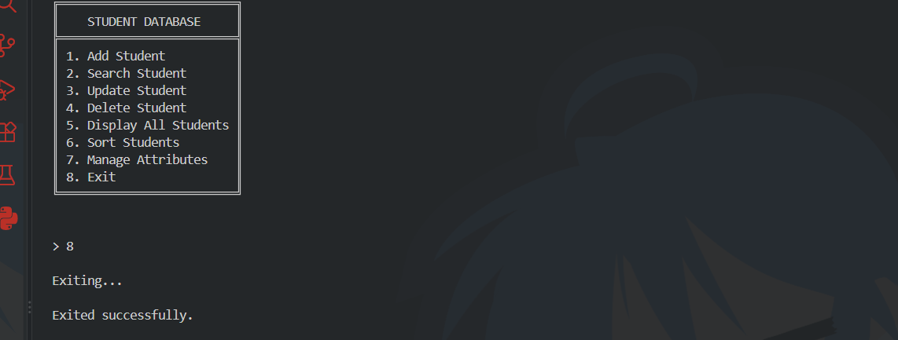
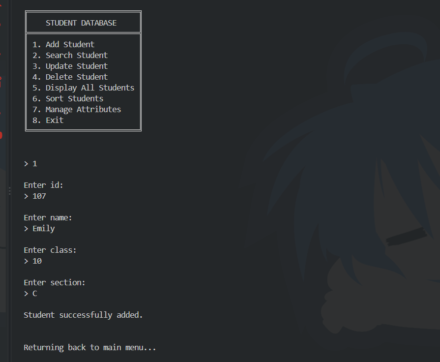
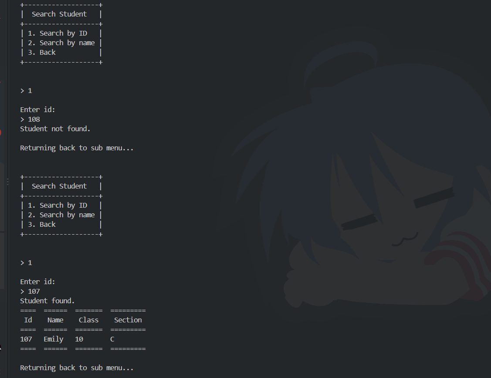
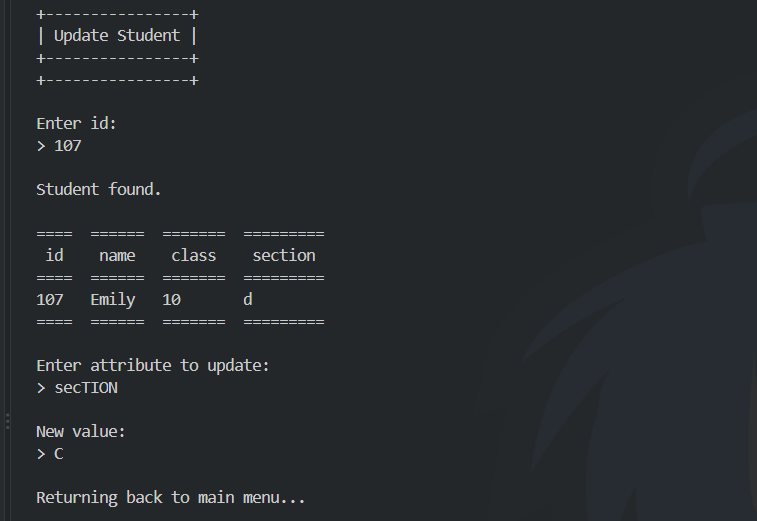
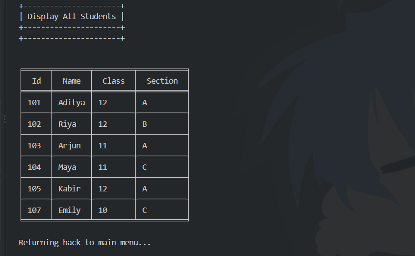
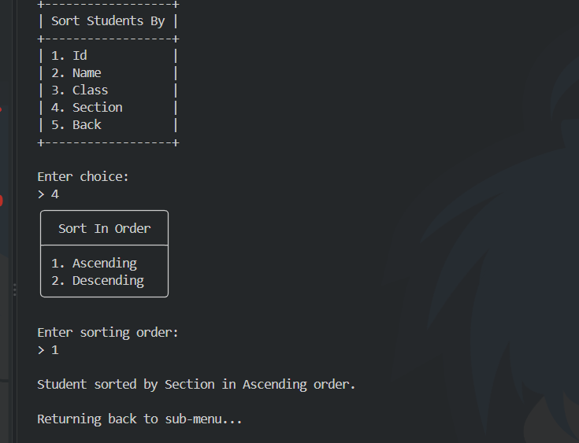
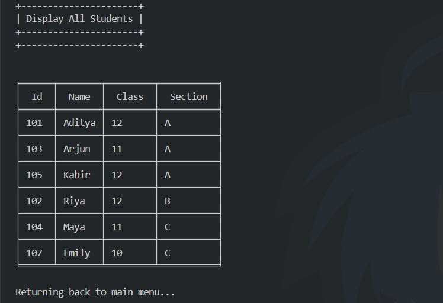
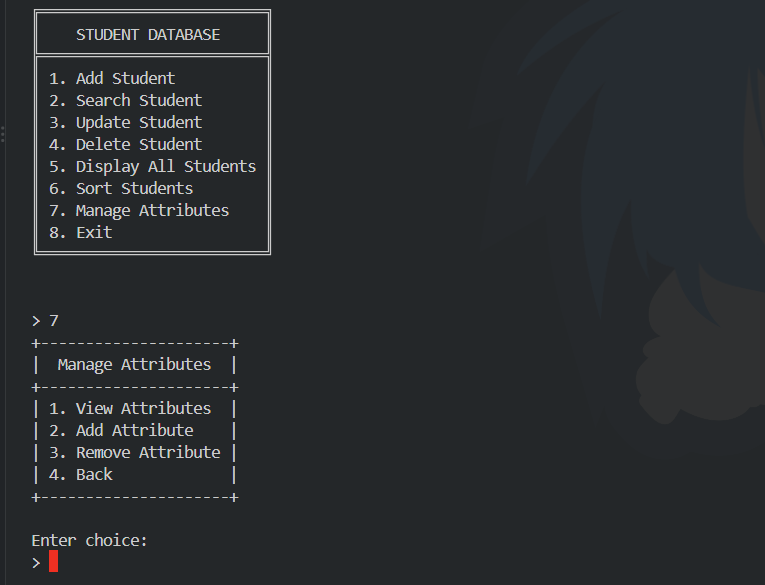
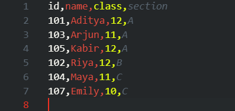

# Student Database

A command-line academic record manager built with Python.

This project evolved from a simple in-memory student database into a
persistent CSV-based system with CRUD operations, searching, sorting,
validation, and dynamic attributes.

---

## Features

- Add student records
- Search students by ID or name
- Update student records
- Delete students with confirmation
- Display all students in formatted tables
- Sort students by any attribute
- Add custom attributes
- Remove custom attributes
- Protect core attributes from removal
- Validate user input
- Persist records using CSV files

---

## Main Menu

The program is operated through a terminal-based menu:



---

## Student Management

### 1. Add Student

A new student is added by entering the values for the attributes currently
defined in the database.

The program validates the input while collecting each value and prevents
duplicate IDs.



### 2. Search Student

Students can be searched using either:

- ID
- Name

ID searches look for an exact match.

Name searches can match the complete name or an individual part of a name.



### 3. Update Student

A student is selected using their ID.

After finding the student, the program displays their current information
and allows one attribute to be updated.

Duplicate IDs are rejected when attempting to change an existing ID.



### 4. Delete Student

A student is selected by ID and displayed before deletion.

The program asks for confirmation before removing the record.

---

## Displaying Students

### Display All Students

All student records can be displayed in a formatted table.

The `tabulate` package is used to make the terminal output easier to read.



---

## Sorting

Students can be sorted according to any attribute currently present in the
database.

The sorting logic separates values into two groups:

1. Numeric values : sorted numerically
2. Non-numeric values : sorted as strings

Numeric values are displayed before non-numeric values.

This allows columns containing mixed types of data to still be sorted in a
predictable way.

### Sorting students by section :




### Displaying sorted students :



---

## Dynamic Attributes

One of the main features of Version 2 is the ability to modify the
database structure itself.

The four core attributes are:

```text
id
name
class
section
```

These attributes are always required and cannot be removed.

Additional attributes can be created by the user.

For example:

```text
id | name | class | section | house | attendance | email
```

An attribute can later be removed if it is no longer required.

This means the program does not depend on a fixed list of student
information beyond the protected core attributes.



---

## Data Storage

Student records are stored in:

```text
student_database.csv
```

The Python `csv` library is used for reading and writing the database.

The CSV header acts as the current structure of the database.

The general flow of the program is:

```text
CSV file
   ↓
DictReader
   ↓
Python dictionaries
   ↓
Processing
   ↓
DictWriter
   ↓
CSV file
```

Because the records are stored in a CSV file, they remain available after
the program is closed.



---

## Validation

The program was designed with invalid and unexpected input in mind.

It handles cases such as:

- Blank input
- Invalid menu choices
- Duplicate IDs
- Invalid IDs
- Nonexistent students
- Duplicate attributes
- Nonexistent attributes
- Attempts to remove core attributes
- Invalid values during student updates

The goal was not simply to make the program work with expected input, but
to consider what could go wrong during normal use.

> What could go wrong?

became an important question while developing the project.

---

## Technologies

### Python

The main programming language used for the project.

### CSV

Python's built-in `csv` library is used to store, read, and modify
student records.

### Tabulate

The third-party `tabulate` package is used to create formatted terminal
tables.

---

## Requirements

- Python 3
- `tabulate`

Install the required package with:

```bash
pip install -r requirements.txt
```

---

## Running the Program

Clone or download the repository and run:

```bash
python student_database.py
```

The program uses `student_database.csv` as its database file.

---

## Project Structure

```text
student-database/
│
├── Screenshots/
├── student_database.py
├── student_database.csv
├── README.md
├── requirements.txt
└── .gitignore
```

---

## Version History

### Version 1 : August 2026

The original version was a simple command-line student database.

It supported:

- Adding students
- Searching students by name
- Displaying students
- Basic input validation

Records were stored only in memory, so they disappeared when the program
closed.

### Version 2 : September 2026

Version 2 redesigned the project around persistent CSV storage.

It introduced:

- Full CRUD operations
- Search by ID and name
- Sorting
- Dynamic attributes
- Stronger validation
- Formatted terminal output
- Persistent student records

---

## Project Story

This project began as a small Python program while learning through
**CS50P**.

At first, the goal was simply to make a program that could add, search,
and display student records.

Then came File I/O and CSV handling.

That changed the project considerably: student data could now exist outside
the running Python program.

As more Python concepts were learned, the small program gradually became a
larger system involving CRUD operations, sorting, validation, dynamic
attributes, dictionaries, CSV processing, and terminal formatting.

Version 2 is still a learning project, but it represents a shift from
writing individual practice programs to designing and building a complete
program around real data and user interaction.

---

## What's Next?

Possible future improvements include:

- Database metadata such as last-updated timestamps
- Further refinement of validation and edge-case handling
- Modularising the code if the project grows substantially

---

**Built while learning Python <3**

---

*Version 2 : September 2026*
